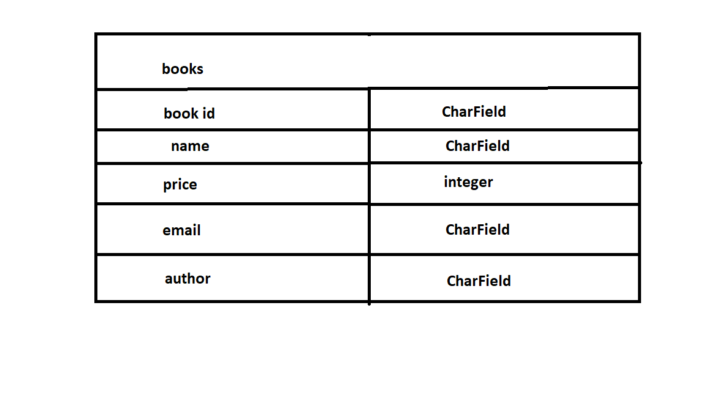
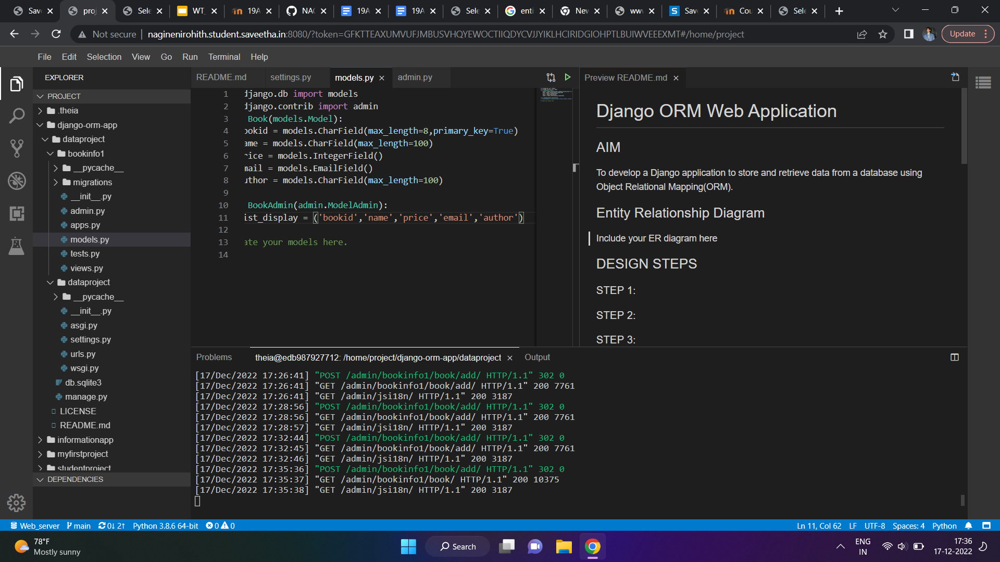
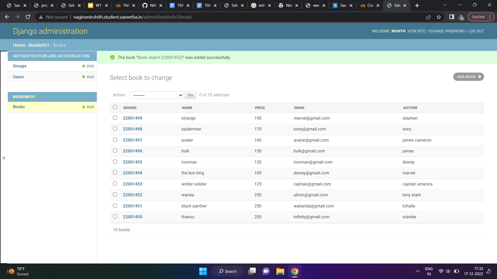

# Django ORM Web Application

## AIM
To develop a Django application to store and retrieve data from a database using Object Relational Mapping(ORM).

## Entity Relationship Diagram



## DESIGN STEPS

### STEP 1:
After clonining git repository we should go to cd   django-orm-app and we have to go into cd dataproject
 then we have to create our app bookinfo1 by using command python3 manage.py startapp bookinfo1 and then we have to make migrations by using command python3 manage.py makemigrations 

### STEP 2:
After migrations we have to migrate data and we have to allow the hosts in settings.py and we have to install our app in settings.py and we have to register our models in admin.py and we have to write our code in models.py 

### STEP 3:
After all that we have to run  our server in port number 80 


## PROGRAM
```
from django.db import models
from django.contrib import admin
class Book(models.Model):
    bookid = models.CharField(max_length=8,primary_key=True)
    name = models.CharField(max_length=100)
    price = models.IntegerField()
    email = models.EmailField()
    author = models.CharField(max_length=100)

class BookAdmin(admin.ModelAdmin):
    list_display = ('bookid','name','price','email','author')
```


## OUTPUT:





## RESULT
successfully excuted
